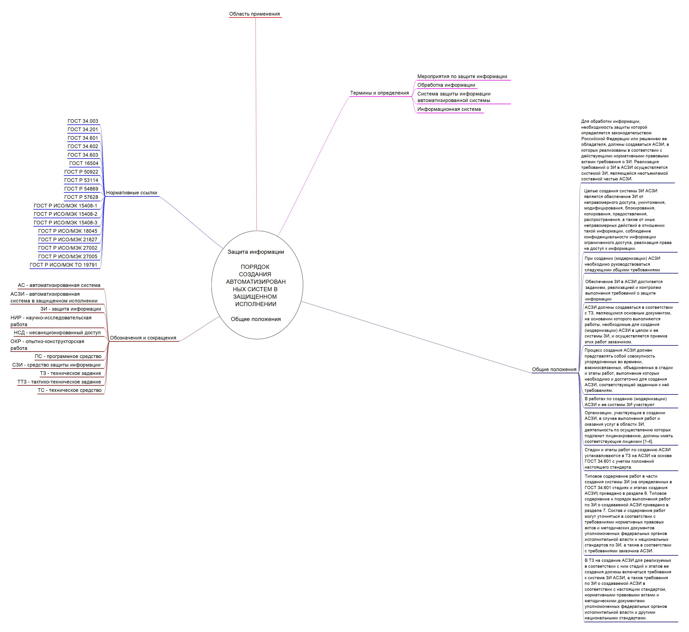

# Работа с ментальной картой
Shevchenko Daniil BISO-03-20

## Цель работы

1.  Изучить международные и российский стандарты, связанные с
    информационной безопасностью
2.  Получить навыки систематизации информации с помощью ментальной карты

## Ход работы

С [сайта “Электронный фонд правовых и нормативно-технических
документов”](https://docs.cntd.ru/document/1200108858) был скачан ГОСТ
51583-2014. Защита информации. Порядок создания автоматизированных
систем в защищенных исполнении. Общие положения.

С помощью программы Freeplane была реализована ментальная карта.

## Вывод

Таким образом, с помощью ментальной карты удалось отобразить информацию
о ГОСТе, в удобном для восприятия виде.
