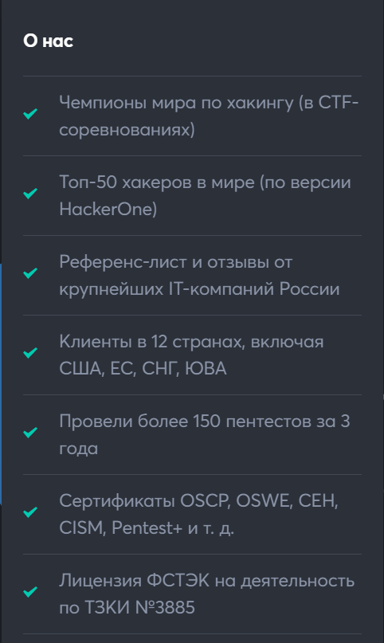
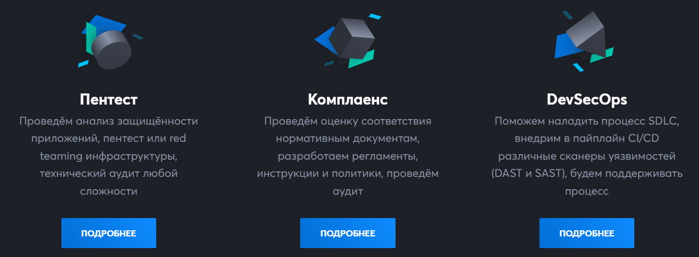
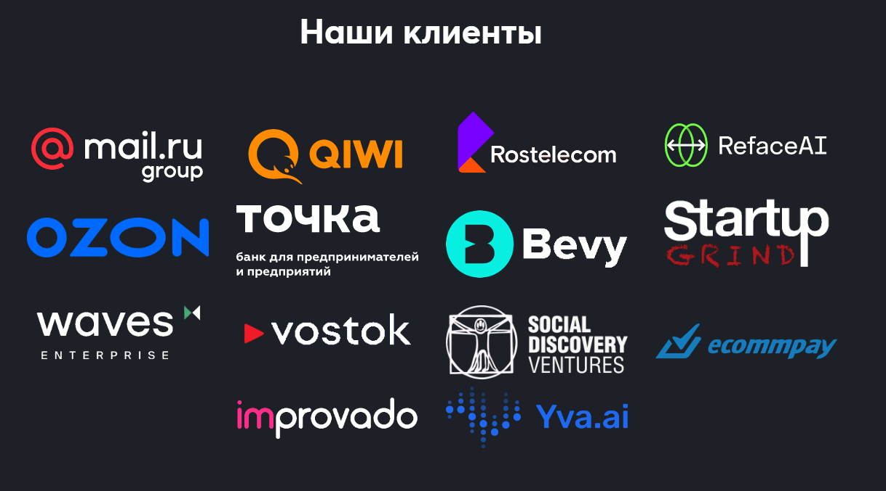
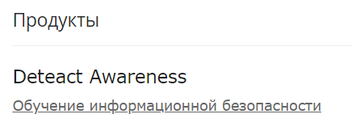

# Применение средств и методов OSINT
Shevchenko Daniil BISO-03-20

## Цель работы

1.  Освоить базовые подходы процессов OSINT
2.  Освоить современные инструменты поиска и сбора информации
3.  Освоить инструменты совместной работы в ходе аналитической
    деятельности

## Общий план выполнения

1.  Собрать информацию о профильных компаниях в сфере ИБ и их продуктах
2.  Собрать информацию об основных специализированных технологиях,
    применяемых в средствах защиты информации.
3.  Собрать информацию о публичных сотрудниках, ведущих профильные
    технологические блоги, профили в социальных сетях и т.д.
4.  Сформировать представление о рынке отечественных решений ИБ \## Ход
    работы

В качестве объекта разведки была выбрана компания Deteact.

## Шаг 1. Полное название компании и инфорация о компании

## Полное название компании:

DeteAct (официально ООО «Непрерывные технологии»)

## Информация о компании:

Это команда хакеров, которая редоставляет услуги по практической
информационной безопасности: тестирование на проникновение (пентест),
анализ защищённости, аудит безопасности, расследования инцидентов.
Входит в топ-50 хакеров в мире (по версии HackerOne) и является
чемпионами мира по хакингу (в CTF-соревнованиях)

## Шаг 2. Основные направления деятельности компании

Основные сферы работы компании Deteact:

## Услуги оказываемые компанией:

1.  Анализ защищённости веб-приложений
2.  Внешний пентест
3.  Внутренний пентест
4.  Пентест в режиме Red Team.
5.  Анализ защищённости мобильных приложений
6.  Аудит безопасности исходного кода
7.  Пентест Wi-Fi.
8.  Аудит безопасности IoT.
9.  Социальная инженерия
10. Консалтинг, аутсорсинг, поддержка

## Производимые продукты:

Эта компания ведёт разработку продуктов и сервисов в области Application
Security и Vulnerability Management.

## Используемые технологии:

Обход Bitrix WAF Обход Content Security Policy Аудит Безопасности Waves
Enterprise Voting Захват Аккаунта Через IDOR DQL-Инъекции

## Шаг 3. Основные клиенты компании

Компании которые являются клиентами Deteact

## Шаг 4. Основные веб-сайты компании и ее продуктов

Главная страница - https://deteact.ru/ Блог компании -
https://blog.deteact.com/ru/

## Шаг 5. Публичные сотрудники компании

Основатель компании: Омар Ганиев -один из самых лучших хакеров страны.
Выступление Омара Ганиева -
https://habr.com/ru/companies/ruvds/articles/546816/ Компания состоит из
10 человек Из выступления: Всем привет, меня зовут Омар Ганиев. Также я
известен под никнеймом beched в хакерской среде. Я – хакер, много лет
занимаюсь проверкой безопасности компьютерных систем. Это стало для меня
хобби еще в школе, а последние 9 лет это – моя основная профессия.
Последние 7 лет я работаю в стартапах в сфере информационной
безопасности, сам являюсь основателем компании DeteAct, она же –
«Непрерывные технологии». Сейчас нас 10 человек, мы хорошо растем и
предоставляем услуги в области практической информационной безопасности.
Тестирование на проникновение, анализ защищенности, прочие разновидности
аудитов безопасности – обо всем этом мы поговорим сегодня.

## Шаг 6. Достижения, ключевые продукты компании

## Развитие продуктового направления

Начаты внедрения системы оркестрации процесса DevSecOps — Deteact AppSec
Platform. Сервис включает в себя продукт для автоматизации процессов
безопасной разработки и услуги по аутсорсингу.

## Расширение географии

Среди клиентов и ранее были заказчики из разных стран, в 2020 году
добавились Великобритания, Сингапур, Киргизия и Португалия.

## Победы в The Standoff

Команда пентестеров DeteAct вошла в тройку лидеров среди 29 атакующих
команд Red Team в масштабных международных киберучениях The Standoff.

## Совместные предприятия

В конце 2020 года совместно с партнёрами открыто направление услуг по
анализу защищённости современных блокчейн-проектов DeFiSecurity.io.

## Успехи сотрудников

Среди успехов сотрудников в 2020 году — попадание в топ-50 хакеров в
мире и топ-6 в России по рейтингу HackerOne, обнаружение уязвимостей в
продуктах Apple, Wordpress, Mail.Ru.

## Вывод

В результате проделанной работы была получена информация о компании
Deteact с помощью метода OSINT
